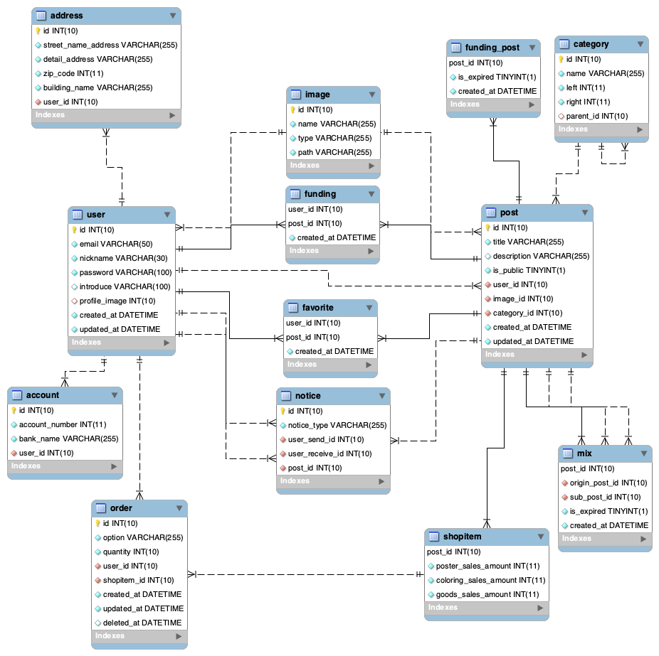

  [](https://github.com/Bletcher-Project/bletcher-back/issues) [](https://github.com/Bletcher-Project/bletcher-back/blob/main/LICENSE)

# Bletcher-back


인공지능 예술 웹 서비스 [Bletcher Project](https://github.com/Bletcher-Project/Bletcher)의 **Web Back-End Repository** 입니다. Node.js 기반의 RESTful API 서버를 구현하였으며 Heroku에 배포되어 있습니다.

> 라이센스에 관련된 내용은 [License](#license)를 참조해주세요.

_👏 우리는 240여개의 commit과 20여개의 branch, 약 30여개의 issue를 통한 긴 개발 과정 끝에 배포되었습니다!!_

_🚀 Version 1.0.0 Released_

---

## Technology


- Node.js
- TypeScript
- Express
- Sequelize
- heroku
- Cloudinary
- mariaDB

## Database Schema Diagram



## 프로젝트 설계 및 배포

- Node.js 프로젝트 설계 : 3 계층 설계 ([▶︎ Issue](https://github.com/Bletcher-Project/bletcher-back/issues/8))
- Category table 구현에 Nested set model 도입 ([▶︎ Issue](https://github.com/Bletcher-Project/bletcher-back/issues/7))
- 데이터베이스 스키마에 따라 Sequelize ORM으로 모델링 ([▶︎ Issue](https://github.com/Bletcher-Project/bletcher-back/issues/16))([▶︎ Issue](https://github.com/Bletcher-Project/bletcher-back/issues/10))
- Heroku를 통한 어플리케이션 배포 ([▶︎ Issue](https://github.com/Bletcher-Project/bletcher-back/issues/25))
- Cloudinary를 통한 Storage Upload ([▶︎ Issue](https://github.com/Bletcher-Project/bletcher-back/issues/27))

## 핵심 기능

- 사용자 인증 부분
  - 회원가입 및 로그인 기능 구현 (비밀번호 암호화 저장)
  - JsonWebToken을 사용한 사용자 인증
  - 회원정보 수정, 삭제 기능 구현
- 게시글 부분
  - 게시물 (게시글 번호 / 작성자 / 카테고리 별) 조건에 따라 불러오는 라우터 구현
  - 유저 별 게시글에 대한 '좋아요' 체크 기능 구현
  - 사용자 별 마이 페이지 게시글 불러오기(Me, Made by me, Used by me) 구현
  - 합성한 게시글에 대한 공개/비공개 구현
- '펀딩 하기' 기능 및 펀딩 게시글의 시간 만료 스케줄 체크 구현
- 이미지 믹스 서버(Django)로 게시글 합성 요청 구현

## 트러블 슈팅

- Cloudinary Warning - SameSite ([▶︎ Issue](https://github.com/Bletcher-Project/bletcher-back/issues/33))
- CORS Error ([▶︎ Issue](https://github.com/Bletcher-Project/bletcher-back/issues/29))
- Node.js 버전 불일치 ([▶︎ Issue](https://github.com/Bletcher-Project/bletcher-back/issues/48))

---

## Getting Started

### Prerequisites

1. node 및 npm 버전을 확인하고 버전에 알맞게 설치해주세요.
   ```
   node v12.14.1
   npm 6.13.4
   ```
2. 실행 전, 루트 경로에 .env.example 파일을 참고한 .env 파일을 생성해주세요.

버전 관련 실행 오류를 겪으신다면 [이 이슈](https://github.com/Bletcher-Project/bletcher-back/issues/48)를 참고해주세요.

### Run

Development Mode

```bash
yarn install
yarn dev
```

Production Mode

```bash
yarn install
yarn build
yarn start
```

## Usage

본 저장소 [Wiki](https://github.com/Bletcher-Project/bletcher-back/wiki)에 구현한 라우터 목록이 정리되어 있습니다.

---

## License<a id="license"></a>

프로젝트의 모든 라이센스는 [MIT License](http://opensource.org/licenses/MIT)를 따릅니다. 상세 라이센스 정보는 [Bletcher License](https://github.com/Bletcher-Project/bletcher-back/blob/master/LICENSE)를 참조해주세요.

---

## Bletcher Team

- 권혁진 - [@KimKwon](https://github.com/KimKwon) - khj9709@icloud.com
- 김동규 - [@kimdg1105](https://github.com/kimdg1105) - kimss7334@naver.com
- 서그림 - [@Seogeurim](https://github.com/Seogeurim) - geulims@naver.com
- 윤가영 - [@yoongoing](https://github.com/yoongoing) - rkdud0925@hanyang.ac.kr
